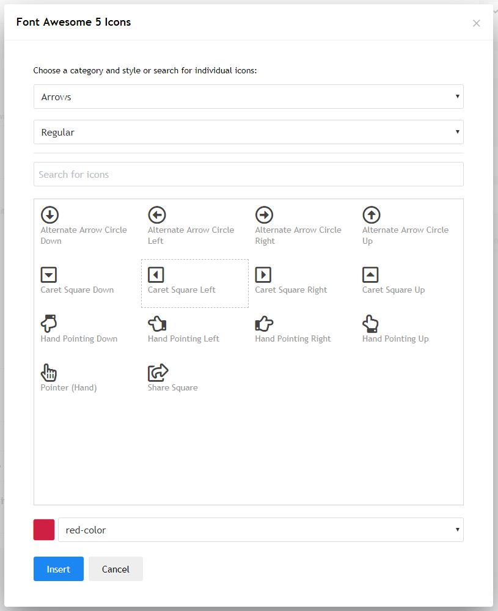

# Craft - Redactor Font Awesome plugin - Craft 2.5

## Installation

This plugin brings Font Awesome to your Craft website. To install:

1. Upload the plugin folder 'coredactorfontawesome' to craft/plugins
2. Include the Font Awesome plugin in your Redactor config file located in craft/config/redactor/-your-config-file-.json. To do so, add 'creativeorangeFontAwesome' in the plugins array.
4. Update your public/assets/... css classes to match those in fontAwesome.css
5. Add facategories.json and faicons.json to your public assets.
6. Activate the plugin in your Craft admin panel

NOTE: Don't forget to include font awesome on your front-end. If you are upgrading from FA4, there is a shim available from FA to help deprecated icon names still work.

### Changelog
2018-04-05: Updated to FA5 (Webfonts with CSS) via JSON documents instead of the hardcoded array and added sorting by category/style.

2017-11-23: Added colour selections and made a scrollable UI.

2015-12-02: Added support for Craft 2.5 and no longer supports < 2.5 - If you need support for Craft < 2.5 please download the release 1.0

### Version
2.0